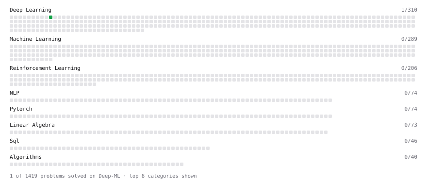

# Deep-ML

My machine learning practice from [Deep-ML](https://www.deep-ml.com). Every solution here was written by hand.

**6** solved · 6 problems · 0 labs · 0 math

[**Browse the interactive portfolio**](https://DenzelDCB.github.io/deep-ml/) to replay this filling in over time.

## Problems

| | Difficulty | Solved | |
| --- | --- | --- | --- |
| [Calculate Accuracy Score](https://www.deep-ml.com/problems/36) | easy | 2026-09-21 | [solution](problems/0036-calculate-accuracy-score) |
| [Convert Vector to Diagonal Matrix](https://www.deep-ml.com/problems/35) | easy | 2026-09-22 | [solution](problems/0035-convert-vector-to-diagonal-matrix) |
| [Implement ReLU Activation Function](https://www.deep-ml.com/problems/42) | easy | 2026-09-21 | [solution](problems/0042-implement-relu-activation-function) |
| [Implementation of Log Softmax Function](https://www.deep-ml.com/problems/39) | easy | 2026-09-21 | [solution](problems/0039-implementation-of-log-softmax-function) |
| [Leaky ReLU Activation Function](https://www.deep-ml.com/problems/44) | easy | 2026-09-21 | [solution](problems/0044-leaky-relu-activation-function) |
| [Linear Kernel Function](https://www.deep-ml.com/problems/45) | easy | 2026-09-21 | [solution](problems/0045-linear-kernel-function) |

---

_This file is regenerated by Deep-ML on every push._
